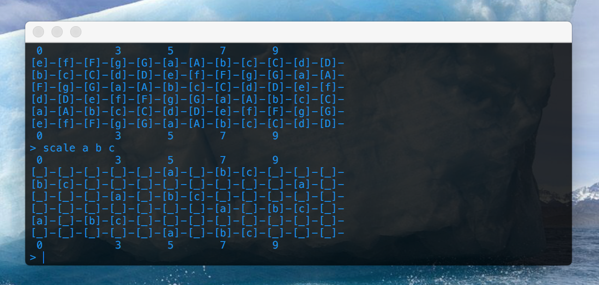

# Fretboard
An app to display and filter the guitar fretboard. 

## Purpose
To learn how to create and test a program in a wide variety of languages. A [report](./docs/report.md) is provided to describe the differences between the languages. After enough rewrites are done, I will choose a final language to continue development.

## Environment
MacOS 10.12.5

## Lanauges  
* **D** - DMD version 2.074.1
* **go** - go version 1.8.3
* **haskell** - ghc version 8.0.2
* **swift** - swift version 3.1

## Commands
  * **fret** = display entire fretboard
  * **scale arg1 ...** = filter fretboard
  * **exit** = exit application

## Examples
`> fret`  
`> scale a b c`  
`> scale a A b`  
`> exit`  

## Help
a = pitch  
A = pitch sharp